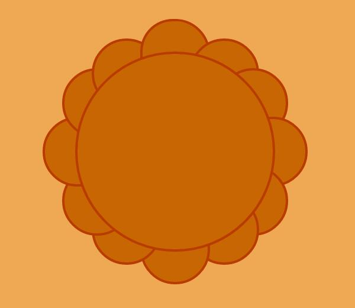
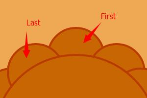
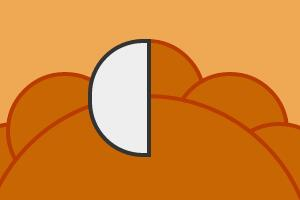
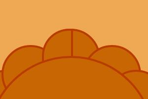
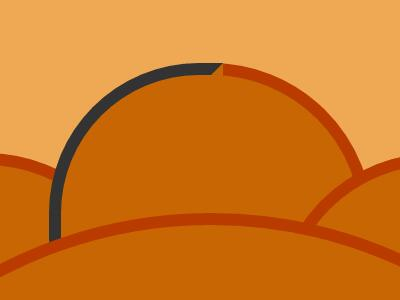
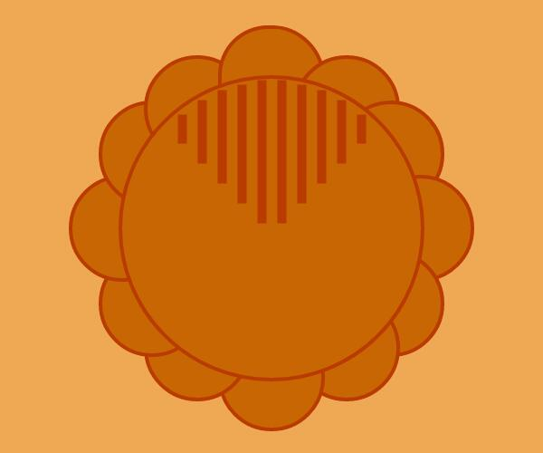
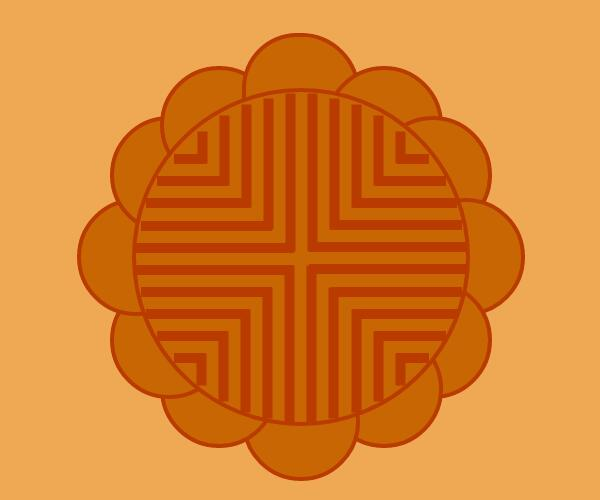
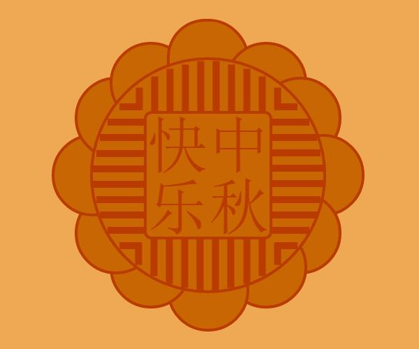

用 CSS3 绘图并不是什么新鲜事，业内有很多大牛都已经尝试过。借着中秋，我们就来画个月饼试试吧。

PS：考虑到我并非学美术出身，美观度方面还请各位多多包涵。

PPS：建议使用 Chrome 浏览器（或其它 webkit、blink 内核的浏览器）查看，效果最佳。

## 基本结构

我把月饼大致分为四个部分：主体圆形、周围的花边、面上的纹理、中间的字。

## 主体圆形

利用 `border-radius` 来绘制圆形，这是 CSS3 绘图中最基本的一个方法。

```css
.main {
  width: 300px;
  height: 300px;
  border-radius: 50%;
  background-color: #C76603;
  border: 4px solid #BA3B00;
}
```
```html
<div class='main'></div>
```

我将背景设为 `position: relative;` ，以便其中的元素能够进行绝对定位。使用 CSS3 绘图时，我们会用到大量的绝对定位。


## 周围的花边

花边的本质也是圆，只不过小一点。这里为了计算方便，我画了 12 个，当然真正的月饼肯定不止这么多，只是我偷懒了，因为纯 CSS3 的环境下没法进行表达式计算，如果借助 JavaScript 或是 LESS、SCSS、SASS 的力量，我们就可以很方便地控制数量，想画多少个就画多少个。

每个小圆通过绝对定位进行放置，结合圆心的坐标以及三角函数关系，就能确定每个小圆的坐标位置。注意，由于盒模型的关系，计算出小圆的圆心坐标之后，还要减去半径，得到盒子左上角的坐标才对。



每个小圆之间是互相叠加的，细心的朋友应该会发现了，最后一个圆会覆盖到第一个圆上，使其变成最下面一层，破坏了连贯性。这里我们用一点点小技巧来解决。



首先我们要让 0 点方向的圆的左半边重新回到最上层，因此我们把 0 点位置的圆复制一下，再利用 `border-radius` 将其变成一个半圆，这样一来，左边就重新出现了。（为了便于理解，这里我改变了一下半圆的颜色和层叠关系）

```html
<div class='ear index12'></div>
```

```css
.ear.index12 {
  height: 100px;
  width: 50px;
  border-radius: 50px 0 0 50px;
}
```




但这也带来了一个新问题：半圆右边有一条竖线。解决办法有两个，一个是单独设置半圆的 `border-right-color: transparent;` ，这个方法有效但并不完美，仔细观察会发现顶部留有一个小小的缺口。



另一个方案就是用一个略小一点的色块来把这条线盖住，这里我们采用的就是这种方法，将半圆复制一下，并进行一定的调整，使其刚好能把这条竖线藏起来，同时又不会挡到1点中方向的小圆。

```html
<div class='ear index13'></div>
```

```css
.ear.index13 {
  width: 25px;
  height: 42px;
  border-radius: 0 25px 0 0;
  border-color: #C76603;
}
```


## 面上的纹理

表面的纹理我选择了十字交错的直线，主要是因为圆形已经用得够多了，想换个风格。我们先从一个直角开始，剩下的只要旋转并对齐就好了。

这里我选择了 `ul>li` 的结构来实现，因为本质上这就是一个由不同长度的线段组成的等距线段列表。只要把 `ul` 定好位，然后通过不断的尝试，设定最佳的数量和长度即可。

```html
<ul class='top-qu'>
  <li></li> // 重复10个
</ul>

```

```css
ul {
  position: absolute;
  padding: 0;
  margin: 0;
}
ul.top-qu {
  top: 128px;
  left: 227px;
  transform: rotate(-90deg);
}
li {
  border: 5px solid #BA3B00;
  height: 0;
  padding: 0;
  margin: 0 0 11px 0;
  list-style: none;
}
li:first-child {
  width: 20px;
  margin-left: 100px;
}
li:nth-child(2) {
  width: 55px;
  margin-left: 80px;
}
li:nth-child(3) {
  width: 85px;
  margin-left: 60px;
}
```



`ul>li` 默认是竖着往下的，也就是朝向3点钟方向的那一个直角。因此其它3个方向的部分需要借助 `transform: rotate(90deg);` 来实现旋转，再调整 `top` 和 `left` 来进行对齐，就完成了。



## 中间的字

字的部分就很简单了，在 `div.text` 里用两个 `p` 写好文字，设置好间距，定好位，给点圆角，就 OK 了。注意，这里需要给文字的边框设置一下背景色，否则它就是透明的，底下的十字交错结构会显示出来。

```html
<div class='text'>
  <p>快中</p>
  <p>乐秋</p>
</div>
```

```css
.text {
  position: absolute;
  width: 160px;
  height: 160px;
  background-color: #C76603;
  border: 4px solid #BA3B00;
  border-radius: 10px;
}
.text p {
  font-size: 80px;
  line-height: 80px;
  padding: 0;
  margin: 0;
  color: #BA3B00;
}
```



## 小结

使用 CSS3 进行图形的绘制，从减轻网络传输负载、提高浏览器渲染效率的角度上讲，是非常好的一个技巧。从技术上讲，只要能把原图产分成基本几何形状的，都能用 CSS3 来实现。但这项技术最大的不足在于代码编写较为费时费力，涉及大量的定位和数值计算工作，重复性劳动较多，因此实战中只能用于元素较为简单的情况，过于复杂的绘图要求在进度上会比较吃力。

业余时间用 CSS3 画点小东西，主要是为了熟悉 CSS3 的一些使用技巧，像盒模型的边框、定位、旋转、斜切，以及如何利用这些基础的东西搭建起一个相对复杂一些的玩意儿。就像是乐高玩具，本身很简单，但发挥想象力，我们可以用它塑造出很多有意思的东西。
