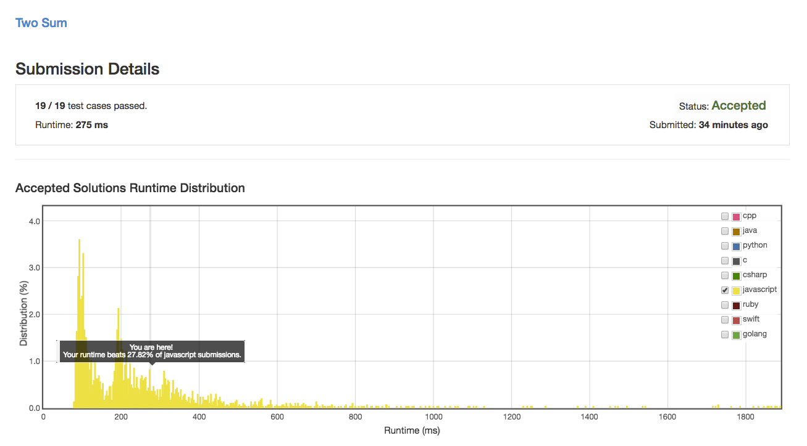

## So，我又来装逼了

前端面试不考算法……嗯，对于刚入行的新人这句话或许没啥大毛病，可一旦开始进阶了，算法早晚会成为瓶颈。于是乎，我开始了……新一轮的装逼之旅。

周围也有不少刷 Leetcode 的，这货和《编程之美》、《剑指Offer》一样被奉为去大公司面试前必做的几件事之一，似乎业界认可度还挺高，那么……我一个俗子就不免俗了，走起！

单就代码执行效率来看，C++、Java 这些编译型语言肯定是远高于 JavaScript 的，不过既然作为前端，从实用角度肯定需要 JavaScript 版本的实现，因此我选择了使用 JavaScript 来实现，文中所有提到的有关性能的分析比对，除非特别说明，默认均基于 JavaScript 环境。

## Two Sum

这是题库里第一题，难度为 Easy，结果 AC 率竟然只有 32% 左右（发文当时数据）……

题目如图


就是说：给定一个整数数组，和一个目标数值，要求找出数组中相加等于目标数值的两个数，以数组形式返回它们的下标（假定每组输入有且只有一组符合条件的解，返回结果不能是同一元素）

## 分析

看题目其实实现起来不难，主要是考察算法的效率，下方的 Tag 其实也给了提示：Array、Hash Table，一方面考察数组的基本操作，另一方面考察查询效率。

## 方案一

本能的第一反应：
1. 穷举绝对能搞定（嵌套循环）
2. 绝对不能这么干

## 方案二

静下心来一想，挨个过肯定是要的，但是否有必要完整遍历呢？肯定是不用的。如果对数组进行一下排序，从两头开始两两相加，如果比目标大则后置位游标向前移一位，如果比目标小则前置位游标向后移一位，相等则得到结果，不就好了。麻烦的是不能直接对传入的数组进行排序，因为还需要返回原始数组的下标，所以要先复制一个出来，单独进行排序，找到匹配的元素后，再看这两个元素在原始数组中的位置。到这里又出现一个新问题，有序数组里的元素如何对应原始数组中的下标？题目假定了每组输入有且只有一组符合条件的解，所以如果原始数组中有重复的元素（比如：3+3=6），最多只会出现两次，如果出现三次及以上就会存在多个解，想清楚了这一点就好办了，如果刚好是这种情况，那一定是从两头找过来到某两个相邻的位置相遇了，因此可以用 `indexOf()` 和 `lastIndexOf()` 来寻找对应下标。

方案代码如下：

```js
const twoSum = function(nums, target) {

  function quickSort(arr) {
    if (arr.length <= 1) { return arr; }
    var pivotIndex = Math.floor(arr.length / 2);
    var pivot = arr.splice(pivotIndex, 1)[0];
    var left = [];
    var right = [];
    for (var i = 0; i < arr.length; i++) {
      if (arr[i] < pivot) {
        left.push(arr[i]);
      } else {
        right.push(arr[i]);
      }
    }
    return quickSort(left).concat([pivot], quickSort(right));
  }

  const sortedNums = quickSort(nums.slice());

  let start = 0, end = nums.length - 1, idxStart = null, idxEnd = null;

  while (start < end) {
    const res = sortedNums[start] + sortedNums[end];
    if (res === target) {
      idxStart = nums.indexOf(sortedNums[start]);
      idxEnd   = nums.lastIndexOf(sortedNums[end]);
      break;
    } else if (res < target) {
      start++;
    } else if (res > target) {
      end--;
    }
  }

  return [idxStart, idxEnd];
}
```


时间主要花在排序上，快排最坏情况下是 O(n<sup>2</sup>) ，查找最坏情况下是 O(n) ，总的算 O(n<sup>2</sup>) 。

空间方面快排最坏是 O(n) ，有序数组占用了 O(n) ，查找占用 O(1) ，总的算 O(n) 。

提交之后 19 个 case 耗时大约 115ms，打败了 70.42% 的提交，第一梯队的成绩大概在 80ms 的样子，最佳成绩大概在 70ms 以内，还是有很大的提升空间的（很好奇怎么做到的，如果不是作弊刷出来的话，那还是很厉害的）。


值得注意的还有第二梯队，在大约 190ms 的位置还有一股小高峰，看来这里有坑，栽了不少人。

## 方案三

70 分还算不错，但距离真正的优秀还差挺多，想着怎么优化一下。根据提示可以用 hash，前面算法里好像没用到，最多查找时候执行了两下，应该不算。看讨论区里说到最多的方案，是在挨个找的同时，用目标数去减当前数，如果所得依然在数组中，那就得到结果，时间为 O(n) ，空间为 O(1) ，感觉效率应该已经到头了，代码如下：

```js
var twoSum = function(nums, target) {

  let res = null, idx = null;
  for (let i = 0, len = nums.length; i < len; i++) {
    res = target - nums[i];
    idx = nums.lastIndexOf(res);
    if (idx > -1 && i !== idx) {
      return [i, idx];
    }
  }
};
```


结果出乎意料，同样 19 个 case 竟然跑了 275ms，只打败了 27.82%。想来算法本身比原来应该是效率高的，大概是 `lastIndexOf()` 也是基于遍历算法，浪费了时间。Java等语言中存在哈希类型的数据结构，因此查询会快许多，因此我们需要用 JavaScript 来实现一个哈希表。


<h3>方案四</h3>

既然锁定了是查询的锅，那么就换种查询方式。JavaScript 中的对象就是一张哈希表，查询效率比遍历高，挨个过的时候判断其“另一半”是否被访问过，如果没有就记录元素自身及其下标，一开始都是未被访问过的，一路都在记录，直到某一刻遇到了匹配的项，凑成了一对，那就输出，注意这时的元素在返回数组中占第二位，哈希表中匹配到的才占第一位。时间复杂度 O(n) ，空间复杂度 O(n) ，等于是用空间换时间。代码如下：

```js
var twoSum = function(nums, target) {
  let res = [null, null], map = {}, j = null;
  for (var i = 0, len = nums.length; i < len; i++) {
    j = map[target - nums[i]];
    if (j !== undefined) {
      res[0] = parseInt(j);
      res[1] = i;
      break;
    }
    map[nums[i]] = i;
  }
  return res;
}
```

测试发现 19 个 case 用了 99ms，打败 81.17% 的提交，还不错，往前进了一步。


截止到目前，这是我能想到的最好的方法，如果有更好的方法，欢迎交流。

## 小插曲

刷题过程中，偶遇了一遭难得的故障 —— Leetcode 全站挂了，从 403 到 500 轮番跳。不过很快页面就恢复了，但主要功能依然无法使用。又过了一会儿，官方在页面上放出公告：由于合作方的设备发生网络故障无法使用，平台暂时回滚到近期的备份，功能已恢复但期间数据将不予保存。请耐心等待更好的解决方案。


被队友坑到整站 Down 掉，Leetcode 的技术团队也是懵逼的（嘴上说着别人，但如果自己遇到这事儿，其实更懵逼），一时难以给出很好的解决办法。从我实际使用情况来看，很有可能是丢数据了，提交记录被回滚，一些曾经发送过的验证邮件也被重发了。

## 小结

算法的意义，是求解，而算法优化的意义，就是不满足于有解，还要寻求最优解，最大化代码的执行效率。对于简单的系统，由于没什么技术含量，对算法也就没什么要求；对于有一定复杂度但规模较小的系统，虽然会涉及到一些算法方面的问题，但由于数据量太小，很多问题还不足以构成负面影响，优化的效果也不明显，从成本考虑不值得去做优化；而对于复杂的大型系统，由于数据量大到一定程度，再小的问题也会被放大，产生负面影响，算法优化的作用就会非常明显，即便是 1ms 的差异也有可能带来质的变化。所以不是前端不需要算法，只是大部分人所接触的项目不需要算法。

作为开发者，不是每个人都有机会去接触那些动辄上亿流量的项目，但作为有追求的开发者，研究算法绝对是提升个人战斗力的有效手段，值得长期投资。如果仅仅因为接触不到对算法要求高的项目就自甘堕落无视算法的作用，那终究只能是停留在现在的水平上，充其量是个经验丰富的老手。想往高处走，去挑战更多的未知，就必须不断磨练自己的硬实力，任何时候，只有过硬的技术才能让一个人或是一家企业扛住外面的狂风暴雨，立于不败之地。