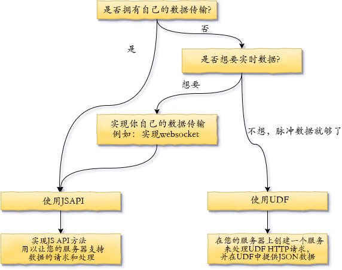
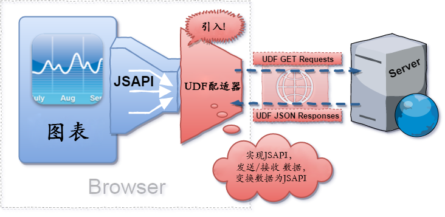

## 0. 竟然被催更了

前两天公司领导居然提到我的博客，说我最近懒了，不更新了……

趁放假，赶紧更新一轮……等等，什么时候这变成工作了？

## 1. TradingView 是个啥

今天咱们说个比较特别的——<a target='_blank' rel='noreffer noopenner' href='https://www.tradingview.com/HTML5-stock-forex-bitcoin-charting-library/'>TradingView</a>，这是一个专业的图表库，专门做 K 线图的，而 K 线图是股票、基金等交易所必备的一样东西。项目本身是免费的，但并不开源，官方提供了托管在 Github 上的私有库，开发者只需向官方提交一些必要的信息，就可以获取到访问权限。主仓库包含了压缩后的库文件，以及简单的数据接入案例；Wiki 中提供了开发文档，同时还在其它的仓库中提供了一些上手案例。

前端常用的几个图表库，像 ECharts、DataV 其实都支持绘制基本的 K 线图（有的称之为蜡烛图，叫法不同而已），配合柱状图和折线图，还能绘制成交量、MA 等指标。TradingView 作为一款专业级的行业产品，除了前面提到的这些图表，还提供了大量的专业测量工具，供专业的投资者和分析师使用，这些用如果全部由开发者自行去实现，会需要花费大量的精力，这种一揽子打包的方案，无疑是它最吸引人的地方。

最近公司正在进行中的一个项目，就是一款数字资产的交易所，竞品调研时候就发现，同行们几乎无一例外的都选择了这个图表库，连火币、FCoin 等行业风向标级别的大厂都选择了这款图表库，可见其在行业当中的权威性，以及近乎垄断的地位。也正因为如此，我们也开始着手研究它。

## 2. 专业 === 麻烦

专业归专业，但这毕竟是针对特定行业特定需求开发的东西，有很多的专业概念、术语、做法我们都不懂，得现学。官方虽然以 Wiki 的形式在 Github 中提供了文档，但文档的质量非常一般，看上去方方面面都覆盖到了，但字里行间充斥着大量晦涩难懂的概念，对参数的注解也是残缺不齐，很多操作上的细节都没有提到，阅读体验非常糟糕。虽然项目官网提供了中文的选项，图表库本身也支持多语言，但是文档却只有英文的（虽然就我个人而言，语言本身并不构成压力；但如果你需要，<a href='https://b.aitrade.ga/books/tradingview/' target='_blank'>这里</a>有一份别人整理的中文版的，还包含了基于 UDF 方案的视频教程，作者来自 TradingView 项目组，是一位资深的开发者。为了讲解方便，这里会用到其中的一些图，感谢<a href='https://github.com/zlq4863947' target='_blank'>作者</a>）。

相比 ECharts、DataV 这种万事俱备，只要填数据、配参数的“民用级”图表库，TradingView 的上手难度要高不少，它需要开发者按照其制定的规则，自行实现一套数据源 API，官方虽然对于每一个 API 的作用、参数都给出了说明，但一些关键的点并没有解释清楚，很多开发者（包括我，和我接触过的一些同行）在看过文档后还是没能很好的理解“这 tm 到底该怎么用”。写这篇博客，就是希望能够为解决这个问题做一点贡献，让后来者能够轻松一些。

## 3. 为了节约时间

先说明一点，这篇博客并不会手把手教你一步一步搭建出整套东西。我假定你至少是先看过一遍官方的文档，并有了初步的尝试之后，遇到问题，求助于搜索引擎，然后才来到的这里。

这篇博客更像是一个 FAQ，根据我自己踩坑的经历，把一些比较不好懂的东西，按我个人的理解分享给各位。

所以如果你指望这篇博客能够让你不用去看官方文档就能够完全掌握 TradingView，轻松把 K 线画出来，那么对不起，要让你失望了。

## 4. 先说一下概念

TradingView 里有一些比较专业的概念，不太好懂，但非常重要，这里简单说明一下。

### 4.1. Symbol

Symbol 直译过来叫“象征、符号”，这里引申为“商品”。K 线表现的是价格的变化趋势，至于是什么东西的价格，可以是股票，可以是货币，也可以是任何一样商品，TradingView 为了通用，提供了这么一个抽象的概念。一个 Symbol 就是一个 JS 对象，描述了商品的一些属性（名称、价格小数位、支持的时间分辨率、交易开放时间等，具体请参考官方文档），图表库会根据 Symbol 的定义，来决定改获取怎样的数据。

商品名称的固定格式为 “EXCHANGE:SYMBOL”，SYMBOL 代表商品，例如一支股票、一个交易对；EXCHANGE 是交易所的名称，同一商品在不同交易所可能会有不同的价格，因此需要进行区分。

### 4.2. Resolution

Study 直译过来叫“分辨率”，这里指 K 线图中相邻两条柱子之间的时间间隔，我没研究过专业术语是不是就是用的这个词，不过个人感觉这就是一种说法，你用别的词也能表达这个意思，只不过 TradingView 选择了这个词。

### 4.3. Study

Study 直译过来叫“学习、研究”，这里解释为“指标”，例如成交量、均线，以及其他各种分析指标。开发者可以通过 TradingView 提供的 API 自行添加。

### 4.4. Chart

图表本体，特指 K 线图及相关的各项指标，不包含工具栏。一个图表实例可以包含多个指标

### 4.5. Widget

小部件，和 Android 上的 Widget 一个概念。图表组件本身可以看做是一个容器，主要是一些工具栏，以及留给绘制真正图表的一块区域，不含图表本体。一个小部件实例可以包含多个图表实例

### 4.6. FeatureSet

功能集，Widget 配置选项中的一部分，用于定制图表库的一些功能（包括显示与否、样式）。

### 4.7. Overrides

覆盖，Widget 配置选项中的一部分，用于定制图表库的样式（主要是图表各部分的颜色）。整个图表库由外层 DOM 结构和内部多个 canvas 组成，因此样式相关的设置也分为两部分，这里是用于 canvas 部分的设置，另外还有一个 `custom_css_url` 属性用于指定一个 css 文件，其中可以覆盖 DOM 部分的样式。具体的可以结合官方文档，以及 Chrome DevTool 来定位。

### 4.8. DataFeed

数据源，也就是接下来要讲的东西。它是 TradingView 获取、处理数据的方法集合，也是 TradingView 数据接入的核心所在，需要用户自己实现。它可以是一个 class 的实例，也可以就是一个简单的对象。

## 5. 如何接入自己的数据

创建图表库实例并不难，看过文档和上手案例的应该都能懂，难的在于怎么把数据给填进去。相信绝大部分为 TradingView 头疼的朋友都是卡在了这里，只要数据接通了，剩下的都是小问题。

TradingView 之所能通用，在于它做到了数据和表现分离，图表库本身只提供表现的部分，不管你有什么样的数据，只要能整理成指定的格式填进去，就行。说白了，需要开发者自行实现一个适配器。

TradingView 提供了两种获取数据的方式，基于 HTTP 的方案（UDF，Universal Data Feed，主仓库中的演示案例就是用的这种），和基于 WebSocket 的方案（JS API）。



无论采用哪种方案，就数据而言都可以分为两部分：截止到目前为止的历史数据，以及之后新生成的数据。

### 5.1. UDF 的方案



UDF 是 TradingView 自己定义的一套协议。本质上其实也是调用的 JS API。协议基于 HTTP + 轮询，通过 HTTP 请求查询指定条件下的历史数据，然后不断轮询检查是否有新数据。

这套方案非常简单，前端部分已经定义好，只要照着案例中提供的演示代码接入接口就可以了（演示代码是用 TypeScript 写的，有一点点额外的认知成本，不过问题不大），主要工作在于后端，需要按照要求提供相应的查询接口，其中最核心的就是获取指定商品、指定分辨率、指定时间范围的数据，具体格式参考官方文档即可。这里我们就不展开了。

轮询——我们知道是一种有效但非常不推荐的做法（除非环境不支持 WebSocket，那只能用它），因为很多时候是轮不到新数据的，非常浪费性能。我们更希望的是每当有新数据到来时，能够主动通知我们，这也就引出了下面的方案。

### 5.2. JS API


这是 TradingView 数据接入的核心，通过这套 API 开发者可以接入任何类型的数据，当然最常见的还是 WebSocket。前面所说的 UDF 的方案其实也是调用的这几个 API。

官方文档对各个 API 都进行了描述，其中必备的有  `onReady()` 、 `resolveSymbol()` 、 `getBars()` 、 `subscribeBars()` 、 `unsubscribeBars()` ，剩下的根据需要自行实现，这里我们只说最基本的使用。前两个没什么难度，我们重点来看下后面几个。（这里我们以 DataFeed 类的实例方法的形式来实现，你也可以简单创建一个包含这些函数的 JS 对象）

#### 5.2.1.  `getBars()`

这个接口专门用于获取历史数据，即当前时刻之前的数据。TradingView 会根据 Resolution 从当前时刻开始往前划定一个时间范围，尝试获取这个时间范围内，指定 Symbol 指定 Resolution 的数据。出于性能考虑，TradingView 只获取可见范围内的数据，超出可见范围的数据会随着图表的拖拽、缩放而分段延迟加载。

这部分的实现代码比较多，我们一步步来，先来实现一个发送数据的内部函数：

```javascript
getBars (symbolInfo, resolution, from, to, onHistoryCallback, onErrorCallback, firstDataRequest) {
  function _send (data) {
    // 按时间筛选
    const dataInRange = data.length
      ? data.filter(n => n.time >= ensureMilliseconds(from) && n.time <= ensureMilliseconds(to))
      : []

    // 没有数据就返回 noData
    const meta = {
      noData: !dataInRange.length
    }

    // 有数据，则整理成图表库要求的格式
    const bar = [...dataInRange]

    // 触发回调
    onHistoryCallback(bar, meta)
  }
}
```

我们把这个函数作为 `getBars()` 的内部函数，其中 `from` 、 `to` 、 `onHistoryCallback` 是 API 提供的参数， `data` 是我们获取到的数据， `{ bar, meta }` 是 TradingView 要求的固定格式。

这个函数负责调用回调函数，把我们获取到的数据传给图表。接下来，我们来获取数据（演示代码，一些涉密、兼容的代码已经省略，只保留最基本的、可公开的逻辑）：

```javascript
getBars (symbolInfo, resolution, from, to, onHistoryCallback, onErrorCallback, firstDataRequest) {

  function _send (data) {
    // ...
  }

  // 出于数据共享的需要
  // 我们把获取到的数据放到 Redux 里
  // 先尝试从 Redux 获取现有数据
  const existingData = store.getState().kChartData || []

  // 如果已有数据，直接读取
  if (existingData.length) {
    _send(existingData)
    return
  }

  // 没数据则通过 WebSocket 加载
  // 我们的设计是历史数据和实时更新都走 WebSocket
  // 首次推送历史数据，后续推送更新
  // 所以同一交易对、分辨率，只会发起一个 WebSocket 请求

  // 先判断功能支持度
  // 这里我们用 WebWorker 把 WebSocket 的逻辑独立到主线程之外
  // 以达到性能优化的目的，这个后面再详述。
  if (!window.Worker) return

  // 限制 Worker 单例
  const hasWSInstance = !!window.kChartWorker
  window.kChartWorker = window.kChartWorker || new window.Worker('./worker-kchart.js')

  // WebWorker 数据推送回调
  window.kChartWorker.onmessage = e => {
    const { data = {} } = e

    // 当有数据推送时
    if (data.kChartData) {
      // 获取已有数据
      const kChartData = [...store.getState().kChartData]
      // 因为数据更新都在末端，所以倒序以加速搜索
      const kChartDataReversed = [...kChartData].reverse()

      // 将更新合并到已有数据
      for (const item of [...data.kChartData]) {
        const idx = kChartDataReversed.findIndex(n => n.time === item.time)
        idx < 0
          ? kChartData.push(item)
          : kChartData[kChartData.length - 1 - idx] = { ...kChartData[idx], ...item }
      }

      // 把新数据记录到 Redux
      const promise = new Promise((resolve, reject) => {
        store.dispatch(setKChartData(kChartData))
        resolve({
          total: kChartData,
          updates: [...data.kChartData]
        })
      })

      promise.then(res => {
        // dataInited 是我们自定义的一个变量
        // 用来区分首次推送和后续推送
        if (this.dataInited) {
          // 如非首次推送
          // 对全局 K 线订阅列表中的每个订阅者（后面详述）
          window.kChartSubscriberList = window.kChartSubscriberList || []
          for (const sub of window.kChartSubscriberList) {
            // 按交易对、分辨率筛选
            if (sub.symbol.id !== this.symbol.id) return
            if (sub.resolution !== resolution) return

            // 通过回调函数推送数据
            if (typeof sub.callback !== 'function') return
            // 图表库一次只能增加一条数据，或更新离现在时间最近的一条历史数据
            // 而我们的推送数据是个数组，可能会包含不止一条数据
            // 所以这里要逐个推送
            for (const update of res.updates) {
              sub.callback(update)
            }
          }
        } else {
          // 首次推送
          _send(res.total)
          this.dataInited = true
        }
      })
    }
  }

  // 准备 WebWorker 消息
  // 只有当没有现成数据的时候
  // 才会执行到这里
  // 所以只有在初始化、切换交易对/分辨率的时候
  // 才会发起 WebSocket 请求
  const msg = {
    action: hasWSInstance ? 'restart' : 'init',
    symbol: symbolInfo,
    resolution: resolution,
    url: WEBSOCKET_URL
  }

  // 发送 WebWorker 消息
  window.kChartWorker.postMessage(msg)
}
```

到这里，我们已经成功获取到历史数据，并把实时更新的推送发送给了各个订阅者（虽然理论上可能始终只有一个订阅者，但从系统设计角度，我们还是这样设计了）。

`getBars()` 其实还好，只要搞清楚其工作机制，其实没什么特别难的，更多的是数据结构的设计以及性能方面的优化。相信令很多人费解的是下面这个函数。

#### 5.2.2.  `subscribeBars()`

文档中说这个函数是用来订阅 K 线数据的，再加上“ `getBars()` 的 `onHistoryCallback` 回调仅一次调用”，这两句话误导了不少人，以为 `getBars()` 只会被调用一次，获取完历史数据就结束了，实时推送的获取需要在 `subscribeBars()` 里实现。事实上，这里只是增加一个订阅者，把添加更新数据的回调函数存到外层，回调函数的调用实际是在前面 `getBars()` 里完成的。相当于这个函数只是排个队，所有数据的获取和分发都在 `getBars()` 里进行。

```javascript
subscribeBars (symbolInfo, resolution, onRealtimeCallback, subscriberUID, onResetCacheNeededCallback) {
  // 限制单例
  window.kChartSubscriberList = window.kChartSubscriberList || []

  const found = window.kChartSubscriberList.some(n => n.uid === subscriberUID)
  if (found) return

  // 添加订阅
  window.kChartSubscriberList.push({
    symbol: symbolInfo,
    resolution: resolution,
    uid: subscriberUID,
    callback: onRealtimeCallback
  })
}
```

这个函数对每个 Symbol + Resolution 的组合都会调用一次，把对应的识别信息和回调函数传递到订阅列表，当推送数据到达时，会遍历订阅列表，找到符合条件的订阅者，调用其回调函数传递数据。其实就是个基本的“观察者模式”。

#### 5.2.3.  `unsubscribeBars()`

了解完 `subscribeBars()` ，那其实 `unsubscribeBars()` 也就很明白了，简单带过：

```javascript
unsubscribeBars (subscriberUID) {
  window.kChartSubscriberList = window.kChartSubscriberList || []

  const idx = window.kChartSubscriberList.findIndex(n => n.uid === subscriberUID)
  if (idx < 0) return

  window.kChartSubscriberList.splice(idx, 1)
}
```

## 6. 如何切换交易对/分辨率

创建完 widget 实例之后，就可以通过特定的方法获取 chart 实例，然后通过特定方法更新 Symbol 和 Resolution，更新操作会以新的参数重新触发之前提到的几个函数。从这个角度看，这几个函数就有点像是生命周期函数，描述了获取数据、订阅更新等一列的操作发生的时机，有开发者决定什么时候该做什么事。

```javascript
this.widget = new window.TradingView.widget(widgetOptions)
this.widget.onChartReady(() => {
  this.chart = this.widget.chart()

  // 设置图表类型（比如分时图和常规的蜡烛图的类型就不一样）
  this.chart.setChartType(chartType)

  // 切换 Symbol
  this.chart.setSymbol(symbol, callback)

  // 切换 Resolution
  this.chart.setResolution(resolution, callback)
})
```

## 7. TradingView 的其他坑

- JS API 中的函数，会在合适的时机自动调用，并传入实参，不用考虑把函数拿到外层去手动调用。
- JS API 中的 `onReady()` 和 `resolveSymbol()` 这两个函数，它们的回调函数必须异步调用，别问为什么，人家要求的。
- 切换 Symbol 和 Resolution 的函数都有一个回调，如果设置的新值和当前现有的值相同，这个回调是不会触发的。

## 8. K 线性能优化

在使用 WebSocket 的过程中，我们用到了 WebWorker 进行性能优化。当交易频率达到一定的程度，WebSocket 会频繁向客户端推送数据，如果把这部分逻辑直接放到 React 组件中，一有新数据就去 `setState()` ，那么页面立马就会被卡得死死的（惨痛的教训）。原理也很简单，间隔时间极短的 `setState()` 会被缓存起来，合并成一次去更新，以减少不必要的计算和渲染，如果数据持续频繁地灌进来，就会攒下一大堆的更新没有被 commit，组件始终进入不了下一轮的 render；加上每次新数据进来都需要和老数据进行增量合并，高频率高负荷的计算会占用主线程的资源，导致没有足够的运算资源用于页面渲染，页面也就卡死了。

明白了这一点，那么方案也就出来了，就是把这些计算密集型的任务从主线程里拿出去，交给并发线程，也就是 WebWorker，去执行。但光是把计算交出去还不够，虽然主线程的计算负载下来了，但更新还是很频繁。科学数据显示，人眼的视觉停留时间大约在 0.1 秒左右，也就是说，即便真的让页面上的数字一秒变化个十几次甚至更多，人眼也根本来不及看清楚，从使用的角度来讲，1 秒变化个 4-5 次已经是极限了，即便 0.5 秒更新一次也完全不影响，所以我们大可不必按照 WebSocket 数据推送的频率去更新页面，我们完全可以建立一个缓冲带，把 WebSocket 推送过来的数据缓存到一个小型的数组里，每隔固定时间间隔去检查数组是否有内容，有就通知主线程更新，没有就啥也别做，这样就在性能和效果之间找到了一个平衡点。

有些人会关心 WebWorker 的兼容性问题，毕竟一般的 H5 页很少会用到这个，不太熟。WebWorker 的浏览器兼容情况和 WebSocket 大致相同，至少在我们关心的范围内，是一致的，都是 IE 10 及以上，常青藤浏览器不用多说早就都支持了，所以除非你还有必须兼容老古董的需求，放心用好了。

## 9. 小结

交易所的这个项目，应该算是近年来接手的比较大的一个项目了，涉及的东西很多，其中不少之前都没接触过，都是现学现卖。过程中遇到了不少的坑，也有了不小的成长。后续我还会分享一些其他方面遇到的坑。