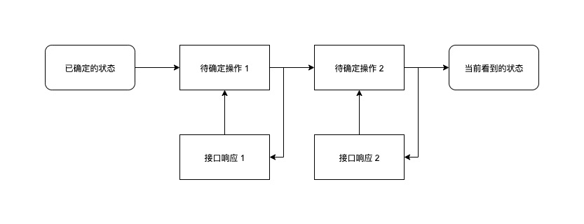

## 终于，我又营业了

2020 年的上半年，比往年任何时候过得都快。转眼已经到了下半年，终于，我又营业了。

在正式开始写这篇文章之前，我特意在百度、知乎、掘金等平台搜了一下「乐观更新」，发现相关的内容屈指可数，讲「乐观锁」的到是有不少。

那正好，就让我来填补一下这个空白吧。

## 什么是「乐观更新」

通常，客户端在发起 CRUD 请求之后，都需要等待服务端返回，然后再去更新视图。这逻辑非常合理，一点毛病没有。唯一的缺点，就是在等待服务端响应的时间里，客户端只能空等，直观感受就是：用户从交互结束，到看到结果，中间免不了会有一个可感知的延迟。稍微对用户体验有所追求的，都会在这个时候显示一个 Loading，让用户知道系统还在运行。

如果你体验过 Google 家的产品，你一定会惊叹于其交互的响应速度，那种按下按钮之后立刻得到结果的快感，就好像一切都发生在本地，根本不用等待接口响应一样。Google 之所以能做到这种程度，并不是因为它是 Google —— 一个掌握着浏览器、网络协议、V8 引擎等核心技术的互联网巨头。人家的方案非常简单：真就是不等待接口返回，请求发出去的同时，直接就把交互的结果体现到视图上。

这就是「乐观更新」：客户端假设请求必然成功，因此不等待接口的返回，先行对视图进行更新。

## 这么乐观，真的大丈夫吗？

乐观虽好，但我们也不能盲目乐观。并不是所有操作都可以通过「乐观更新」的方式来实现，需要有一些前提条件：

- 操作成功率非常高，大概率是不会失败的
- 接口正常响应的耗时很短
- 即便操作失败，或是误操作了，也可以轻易的撤销。

像发送一条消息、删除一个文件，这些都是可以考虑「乐观更新」的，能够大幅提升用户体验。

你能想象每发一条微信消息都会出现一个 Loading 的场景吗？Windows 10 已经默认把删除到回收站的确认框取消了你发现了吗？

反过来，像文件传输、鉴权相关的操作，就不适合「乐观更新」了。

你能想象迅雷还没开始下载就直接显示下载完毕了吗？或者用支付宝付款的时候，先显示支付成功，然后才告诉你余额不足吗？

## 要乐观，也要悲观

在一个良好的网络环境中（如 Wifi、4G），接口的返回大概率会是成功的。因此客户端在发起请求的同时，完全可以大胆假设接口的返回就是成功的。既然已经知道了结果，那就不用非得等接口了，直接就可以进行后面的操作。

然而这一系列的操作，全都是基于一个假设，既然是假设，那就必然有猜错的时候。为了确保系统逻辑的正确，我们必须要为这种情况做好准备。

因此，尽管「乐观更新」不等接口返回就已经开始后面的流程，但这并不表示我们对接口的返回就完全不关心了，还是需要等待接口的返回结果，来验证之前的操作是否真的有效。大概率下返回结果和预期是一致的，我们不用额外处理；但如果有偏差，就需要撤销之前的操作，并且告知用户。

## 自己搭一套乐观更新机制

首先，我们来设计一下乐观更新的基本架构。

大体上和 Flux 的架构差不多，还是一个 `reducer(state, action) => state` 的过程
